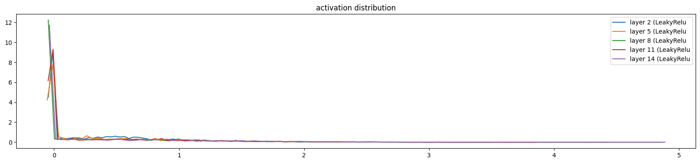
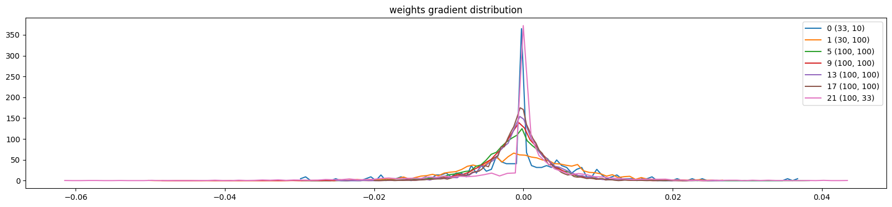

# Multi-Layer Perceptron (MLP) Language Model

This project implements a multi-layer perceptron (MLP) language model inspired by [Andrej Karpathy's work](https://www.youtube.com/watch?v=P6sfmUTpUmc&t=6004s). This model leverages a multi-layer structure to predict the next character in a sequence of names, effectively learning the structure and patterns of names provided in a dataset. The model was built from scratch, implementing key components such as custom linear layers, batch normalization, activation functions, and an Adam optimizer. The complete code for the model can be found in the `notebooks/model.ipynb` file.

The training loss achieved was **2.09**, while the validation loss was **2.13**


Below are some sample names generated by the model:

- ammyah
- seel
- ndheyah
- renya
- jendraig
- azeer
- melin

## Table of Contents
- [Introduction](#introduction)
- [Code Segments](#code-segments)
  - [1. Imports and Vocabulary Setup](#1-imports-and-vocabulary-setup)
  - [2. Dataset Construction](#2-dataset-construction)
  - [3. Model Components](#3-model-components)
  - [4. Model Architecture](#4-model-architecture)
  - [5. Training Loop](#5-training-loop)
  - [6. Activation Distribution Visualization](#6-activation-distribution-visualization)
  - [7. Gradient Distribution Visualization](#7-gradient-distribution-visualization)
  - [8. Weights Gradient Distribution Visualization](#8-weights-gradient-distribution-visualization)
  - [9. Gradient-to-Data Ratio Visualization](#9-gradient-to-data-ratio-visualization)

## Introduction

The goal of this project was to build an MLP language model from scratch to predict the next character in a sequence of letters based on a training set of names. The dataset comprises various names, and each character is mapped to a unique integer value to build sequences for training. Key features of this model include:
- Custom layers implemented without external neural network libraries.
- Usage of Leaky ReLU activation and Batch Normalization to improve performance and stability.
- Custom implementation of the Adam optimizer.
- Comprehensive visualizations to analyze activation, gradient, and weight distributions.

## Code Segments

### 1. Imports and Vocabulary Setup

```python
import torch
import torch.nn.functional as F
import numpy as np
import torch.nn as nn
import matplotlib.pyplot as plt
%matplotlib inline

words = open('names.txt').read().splitlines()
# build vocab of characters and mappings to / from integers
chars = sorted(list(set(''.join(words))))
stoi = {s:i+1 for i, s in enumerate(chars)}
stoi['.'] = 0
itos = {i:s for s, i in stoi.items()}
vocab_size = len(stoi)
```
This section initializes necessary libraries and builds a vocabulary of characters, where each unique character is mapped to an integer. The vocabulary size is essential in defining the output layer size for the model.


### 2. Dataset Construction

```python
import random
# build the dataset
block_size = 3

def build_dataset(words):
    X, Y = [], []

    for w in words:
        context = [0] * block_size
        for ch in w + '.':
            ix = stoi[ch]
            X.append(context)
            Y.append(ix)
            context = context[1:] + [ix]
    X = torch.tensor(X)
    Y = torch.tensor(Y)
    return X, Y

random.seed(42)
random.shuffle(words)
n1 = int(0.8 * len(words))  
n2 = int(0.9 * len(words))
Xtrain, Ytrain = build_dataset(words[:n1])
Xdev, Ydev = build_dataset(words[n1:n2])
Xtest, Ytest = build_dataset(words[n2:])
```
This segment creates training, validation, and test datasets by breaking down each name into sequences of characters and labels for supervised training.


### 3. Model Components

```python
g = torch.Generator().manual_seed(42)

class Linear:
    def __init__(self, fan_in, fan_out, bias=True):
        self.weight = torch.randn((fan_in, fan_out), generator=g) / (fan_in**0.5) 
        self.bias = torch.zeros(fan_out) if bias else None
    
    def __call__(self, x):
        self.out = x @ self.weight
        if self.bias is not None:
            self.out += self.bias
        return self.out
    
    def parameters(self):
        return [self.weight] + ([] if self.bias is None else [self.bias])

class BatchNorm1d:
    def __init__(self, dim, eps=1e-5, momentum=0.1):
        self.eps = eps
        self.momentum = momentum
        self.training = True

        self.gamma = torch.ones(dim)
        self.beta = torch.zeros(dim)

        self.running_mean = torch.zeros(dim)
        self.running_var = torch.ones(dim)

    def __call__(self, x):
        if self.training:
            xmean = x.mean(dim=0, keepdim=True)
            xvar = x.var(dim=0, keepdim=True)
        else:
            xmean = self.running_mean
            xvar = self.running_var
        
        xhat = (x - xmean) / torch.sqrt(xvar + self.eps)
        self.out = self.gamma * xhat + self.beta

        if self.training:
            with torch.no_grad():
                self.running_mean = (1 - self.momentum) * self.running_mean + self.momentum * xmean
                self.running_var = (1 - self.momentum) * self.running_var + self.momentum * xvar

        return self.out
    
    def parameters(self):
        return [self.gamma, self.beta]
    
class LeakyRelu:
    def __call__(self, x):
        self.out = torch.nn.functional.leaky_relu(x)
        return self.out
    
    def parameters(self):
        return []
    

class Adam:
    def __init__(self, params, lr=0.001, beta1 = 0.9, beta2 = 0.999, eps = 1e-08):
        self.lr = lr
        self.params = params
        self.beta1 = torch.tensor(beta1)
        self.beta2 = torch.tensor(beta2)
        self.eps = eps
        self.m_d = {id(p) : torch.zeros_like(p) for p in params}
        self.v_d = {id(p) : torch.zeros_like(p) for p in params}
        self.t = 1

    def step(self):
        for param in self.params:
            grad = param.grad
            m = self.m_d[id(param)]
            v = self.v_d[id(param)]

            next_m = (torch.multiply(self.beta1, m) + torch.multiply(1.0 - self.beta1, grad))
            next_v = (torch.multiply(self.beta2, v) + torch.multiply(1.0 - self.beta2, torch.pow(grad, 2)))

            m_hat = torch.divide(next_m, (1 - torch.pow(self.beta1, self.t)))
            v_hat = torch.divide(next_v, (1 - torch.pow(self.beta2, self.t)))

            param.data = param.data - torch.divide(torch.multiply(self.lr, m_hat), (torch.sqrt(v_hat) + self.eps))

            self.m_d[id(param)] = next_m
            self.v_d[id(param)] = next_v
        self.t += 1
```
This section defines the custom components of the MLP: Linear layer, BatchNorm1d, Leaky ReLU activation, and Adam optimizer. Each component is implemented from scratch to allow full control over the training process and model behavior.


### 4. Model Architecture

```python
n_embd = 10
n_hidden = 100
block_size = 3
g = torch.Generator().manual_seed(2147483647)

C = torch.randn((vocab_size, n_embd), generator=g)

# for training: 
layers = [
    Linear(n_embd * block_size, n_hidden), BatchNorm1d(n_hidden), LeakyRelu(),
    Linear(n_hidden, n_hidden),  BatchNorm1d(n_hidden), LeakyRelu(),
    Linear(n_hidden, n_hidden),  BatchNorm1d(n_hidden), LeakyRelu(),
    Linear(n_hidden, n_hidden),  BatchNorm1d(n_hidden), LeakyRelu(),
    Linear(n_hidden, n_hidden),  BatchNorm1d(n_hidden), LeakyRelu(),
    Linear(n_hidden, vocab_size), BatchNorm1d(vocab_size),
]

with torch.no_grad():
    layers[-1].gamma *= 0.1
    for layer in layers[:-1]:
        if isinstance(layer, Linear):
            layer.weight *= np.sqrt(2 / (1 + (0.01)**2))

parameters = [C] + [p for layer in layers for p in layer.parameters()]
parameters
print(sum(p.numel() for p in parameters))
for p in parameters:
    p.requires_grad_()
```
Here, the model architecture is defined, using multiple Linear and BatchNorm1d layers followed by Leaky ReLU activation functions. A final linear layer produces outputs matching the vocabulary size, allowing the model to predict the next character.


### 5. Training Loop

```python
max_steps = 20000
batch_size = 64
lossi = []
ud = []
lr = 0.001
# optimizer = torch.optim.Adam([p['param'] for p in parameters], lr=0.001)  
optimizer = Adam([p for p in parameters], lr=lr)

for i in range(max_steps):
    ix = torch.randint(0, Xtrain.shape[0], (batch_size, ), generator=g)
    Xb, Yb = Xtrain[ix], Ytrain[ix]

    C_params = C
    emb = C_params[Xb]
    x = emb.view(emb.shape[0], -1)
    for layer in layers:
        x = layer(x)
    loss = F.cross_entropy(x, Yb)

    for layer in layers:
        layer.out.retain_grad()
    for p in parameters:
        p.grad = None
    loss.backward()

    # adam optimizer:
    optimizer.step()

    # stochastic gradient descent:
    # lr = 0.1 if i < 100000 else 0.01
    # for p in parameters:
    #     p.data -= lr * p.grad
Weights Gradient Distribution
    if i % 100 == 0:
        print(f"{i:7d}/{max_steps:7d}: {loss.item():.4f}")
    lossi.append(loss.log10().item())
    with torch.no_grad():
        ud.append([(lr * p.grad.std() / p.data.std()).log10().item() for p in parameters])
```
The training loop optimizes model parameters by minimizing cross-entropy loss. Additionally, the loop logs the loss and updates the gradient-to-data ratios for visualization.


### 6. Activation Distribution Visualization

```python
# visualize histograms
plt.figure(figsize=(20, 4)) # width and height of the plot
legends = []
for i, layer in enumerate(layers[:-1]): # note: exclude the output layer
  if isinstance(layer, LeakyRelu):
    t = layer.out
    print('layer %d (%10s): mean %+.2f, std %.2f, saturated: %.2f%%' % (i, layer.__class__.__name__, t.mean(), t.std(), (t.abs() < 0.01).float().mean() * 100))
    hy, hx = torch.histogram(t, density=True)
    plt.plot(hx[:-1].detach(), hy.detach())
    legends.append(f'layer {i} ({layer.__class__.__name__}')
plt.legend(legends)
plt.title('activation distribution')
```
This visualization helps monitor activation values throughout the model, ensuring they maintain healthy distributions to avoid issues like saturation.



### 7. Gradient Distribution Visualization

```python
# visualize histograms
plt.figure(figsize=(20, 4)) # width and height of the plot
legends = []
for i, layer in enumerate(layers[:-1]): # note: exclude the output layer
  if isinstance(layer, LeakyRelu):
    t = layer.out.grad
    print('layer %d (%10s): mean %+f, std %e' % (i, layer.__class__.__name__, t.mean(), t.std()))
    hy, hx = torch.histogram(t, density=True)
    plt.plot(hx[:-1].detach(), hy.detach())
    legends.append(f'layer {i} ({layer.__class__.__name__}')
plt.legend(legends);
plt.title('gradient distribution')
```
This plot tracks the distribution of gradients, helping diagnose issues like exploding or vanishing gradients.


### 8. Weights Gradient Distribution Visualization

```python
# visualize histograms
plt.figure(figsize=(20, 4)) # width and height of the plot
legends = []
for i,p in enumerate(parameters):
  t = p.grad
  if p.ndim == 2:
    print('weight %10s | mean %+f | std %e | grad:data ratio %e' % (tuple(p.shape), t.mean(), t.std(), t.std() / p.std()))
    hy, hx = torch.histogram(t, density=True)
    plt.plot(hx[:-1].detach(), hy.detach())
    legends.append(f"{i} {tuple(p.shape)}")
plt.legend(legends)
plt.title('weights gradient distribution');
```
Monitoring weight gradients offers insights into parameter updates, critical for stability and convergence.



### 9. Gradient-to-Data Ratio Visualization

```python
plt.figure(figsize=(20, 4))
legends = []
for i,p in enumerate(parameters):
  if p.ndim == 2:
    plt.plot([ud[j][i] for j in range(len(ud))])
    legends.append('param %d' % i)
plt.plot([0, len(ud)], [-3, -3], 'k') # these ratios should be ~1e-3, indicate on plot
plt.legend(legends);
```
This plot tracks the gradient-to-data ratio over training, providing insights into the optimization process's stability.

